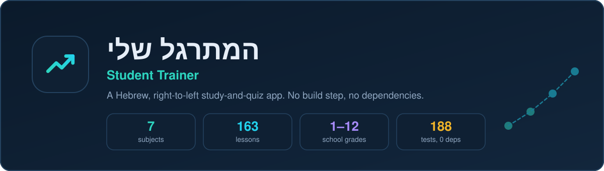
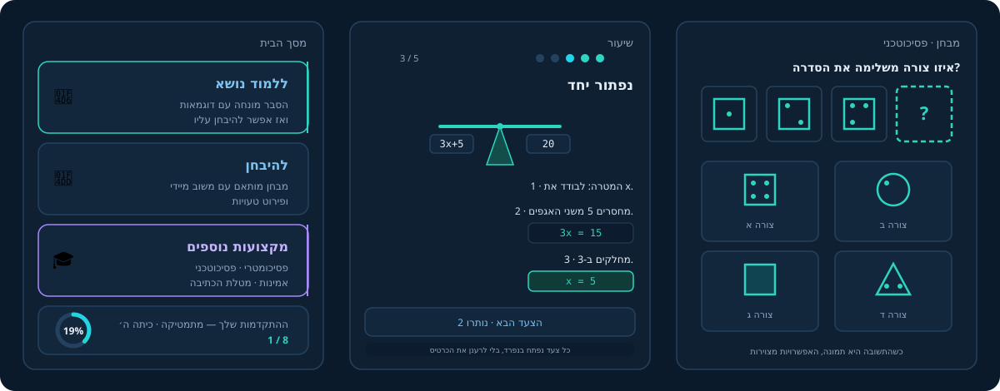
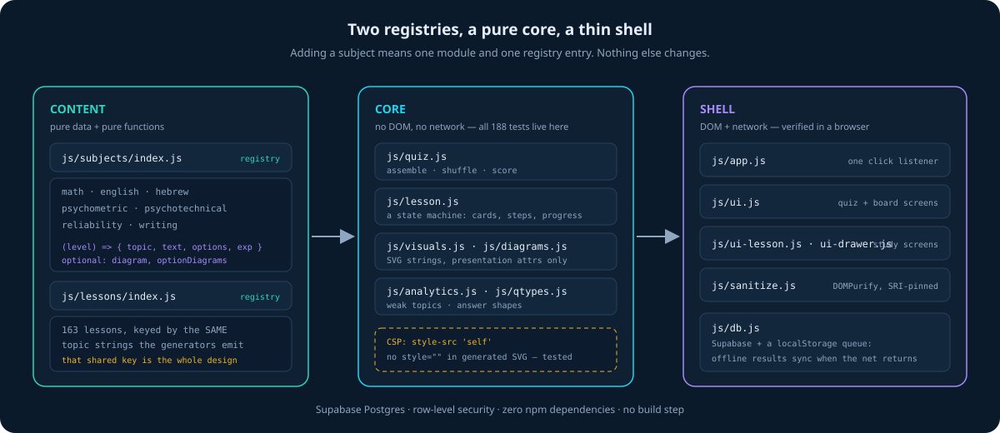

### **[▶ Open the app](https://eagle84.github.io/Student_Trainer/)**

---

**המתרגל שלי** is a Hebrew, right-to-left study-and-quiz app for Israeli school
students. A student picks a subject, **learns** a topic through a guided lesson,
then **sits a quiz** on that exact topic — and the app remembers which topics
keep going wrong so it can send them back to the right lesson.

It covers the Ministry of Education curriculum for grades 1–12, plus four
preparation tracks that belong to no school year at all.

---

## What it looks like

Three paths from the home screen: **learn a topic**, **sit a quiz**, or open
**מקצועות נוספים** — the preparation subjects that aren't tied to a grade.

---

## What it teaches

| Subject | Grades | Covers |
|---|:---:|---|
| 🧮 **מתמטיקה** | 1–12 | Arithmetic through calculus, split by 3/4/5 יח״ל in the upper grades |
| 🔤 **אנגלית** | 4–12 | Vocabulary, all the tenses, modals, conditionals, passive, reading |
| א **עברית** | 4–12 | Roots, בניינים, סמיכות, syntax, comprehension, register |
| 🎯 **פסיכומטרי** | — | Quantitative, verbal and English sections |
| 🧩 **פסיכוטכני** | — | Shape series, matrices, rotation, cube folding, instructions, accuracy |
| 🛡️ **מבחני אמינות** | — | What the scales measure, consistency, situational judgement |
| ✍️ **מטלת הכתיבה** | — | Thesis, structure, connectives, register, the marking rubric |

Every topic the quiz can ask about is listed in the catalogue, and **186 lessons**
stand behind them.

### And five games

The same questions, against a clock. Each mode asks something different, so a
score in one says nothing about a score in another — and the boards are kept
separate accordingly.

| Game | The rule | What it measures |
|---|---|---|
| **ספרינט** | 60 seconds; a wrong answer costs 3 of them | How fluent the recall is |
| **דיוק** | One mistake ends the run | Whether you can be careful at speed |
| **טיפוס** | Every right answer raises the level; three mistakes end it | Where your ceiling is |
| **בזק** | Exactly 20 questions, the same for everyone | Accuracy over a fixed workload |
| **הישרדות** | The clock shrinks with every question | The speed at which you break |

Boards are per game, per subject and per difficulty, and a posted score cannot
be edited or deleted.

---

## What makes it work

**Lessons and questions share one key.** A lesson is filed under the exact
`topic` string its generator produces. That single shared key is what lets "you
got אחוזים wrong three times" become a link straight to the אחוזים lesson —
with no lookup table to drift out of date.

**Questions are generated, not stored.** Most come from pure functions that take
a difficulty level and scale themselves, so the bank never runs dry and a
hundred-question quiz doesn't repeat. A hand-authored question bank supplements
them where a human-written item is better.

**Answers can be pictures.** Shape series, Raven matrices, rotations and cube
nets are drawn as SVG — in the question *and* in the four options.

**Progress is honest.** The ring measures how much of the material at your grade
you have actually worked through, counting a part-read lesson for its fraction.
Stopping halfway through a lesson still counts.

**It works offline.** Lose the network mid-quiz and results queue locally, then
sync themselves when it returns.

---

## How it's built

A static site with **no build step and zero npm dependencies** — the files that
are served are the files that were written. State lives in Supabase Postgres
behind row-level security. The parts that can be tested without a browser are
kept free of the DOM and the network, and carry **288 tests** that run on Node's
built-in runner with nothing to install.

Accessibility and correctness get the same treatment as features: a strict
Content-Security-Policy with no inline styles, bidi isolation so mathematical
notation never reorders inside Hebrew prose, keyboard paths through every
control, and `prefers-reduced-motion` respected throughout.

---

## Licence

Copyright © 2026 Igal Bogus. **All rights reserved.**

This repository publishes the application so students can use it. That is not a
grant of permission to copy, adapt or republish it. See [LICENSE](LICENSE).

*Development happens in a separate private repository; this one mirrors the
deployed site.*

